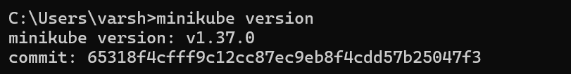

# Experiment 16: Install and Configure Kubernetes Locally using Minikube

## Aim
To install and configure a Kubernetes cluster locally using Minikube and verify that the setup is working properly.

## Software / Tools Required
- Docker Desktop
- Minikube
- kubectl (Kubernetes CLI)
- Windows 11 (Command Prompt)

## Procedure
1. Verified Docker installation using:
   ```bash
   docker --version
   ```
2. Installed kubectl CLI tool.
3. Installed Minikube using the Windows binary.
4. Started Minikube cluster using Docker as the driver:
   ```bash
   minikube start --driver=docker --image-mirror-country=in
   ```
5. Verified the cluster node using:
   ```bash
   kubectl get nodes
   ```
6. Observed that the Minikube node is in **Ready** state.

## Output

### 1. Minikube Version


### 2. Minikube Start (Cluster Setup)


### 3. Node Status


## Result
Successfully installed and configured Kubernetes locally using Minikube.
The node status was **Ready**, confirming that the Kubernetes cluster is running successfully.
